# Aurora Software Guide

This software provide some shell commands to demo how to drive devices on the Aurora Device.

## Specification

For Aurora 100
|Item|Values|
|----|------|
|Memory|512MB DDR3 RAM(测速)|
|Storage| 4GB 8-bit eMMC on-board flash(测速)<br>SD slot|	
|Peripheral Interface| 1 x USB Host<br>1 x 100M Ethernet interface<br>1 x Record interface<br>1 x Play interface<br>2 x Relay output interface(MAX 30V/2A))<br>2 x GPIO input interface<br>1 x Extern 12V interface(MAX 2A)<br>1 x USB OTG<br>1 x SD card interface <br>1 x TTL UART|
|On-board LED|1 x Power LED<br>1 x user-defined LED|
|Power|1 x DC interface (24V/2.5A)|
|Button|1 x reset button|
|Knob|1 x sound volume knob|
|Operating temperature(C) | 0 ~ 90 (refer to [am3358](https://www.ti.com/product/AM3358))|

For Aurora 200

|Item|Values|
|----|------|
|Memory|512MB DDR3 RAM(测速)|
|Storage| 4GB 8-bit eMMC on-board flash(测速)<br>SD slot|	
|Peripheral Interface| 1 x USB Host<br>4 x 100M Ethernet interface<br>1 x Record interface<br>2 x Play interface<br>3 x Relay output interface(MAX 30V/2A)<br>3 x GPIO input interface<br>1 x Extern 12V interface(MAX 2A)<br>1 x USB OTG<br>1 x SD card interface <br>1 x TTL UART|
|On-board LED|1 x Power LED<br>1 x User-defined LED<br>1 x Network status LED|
|Power|1 x DC interface(24V/2.5A)|
|Button|1 x Reset button|
|Knob|1 x Sound volume knob|
|Operating temperature(C) | 0 ~ 90 (refer to [am3358](https://www.ti.com/product/AM3358))|

## Hardware Overview 

It is convenient to use this hardware overview for finding the location of the hardware.

For Aurora 100

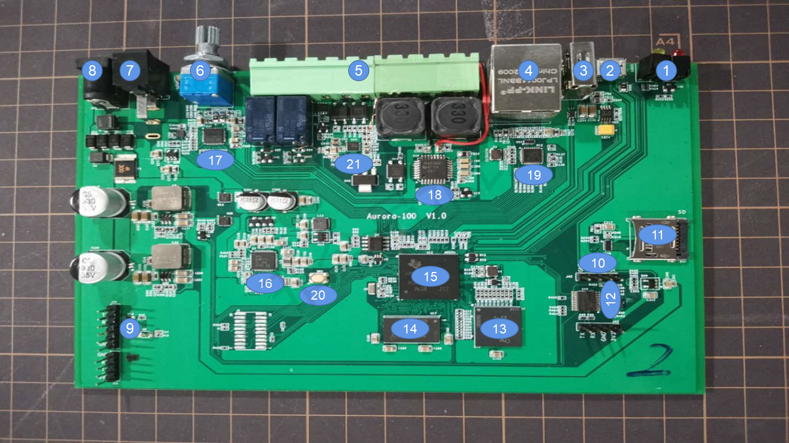

- **1. LED:** Include power LED and user-defined LED.

- **2. USB OTG:** This USB Port is used to connect to your computer via serial mode of putty.

- **3. USB Host:** You can plug USB device, such as USB mouse,USB keyboard and USB flash disk into Aurora via those two USB hosts.

- **4. Ethernet interface:** Access to the Internet.

- **5. Extern Interface:** Include 1 x Record interface , 1 x Play interface , 2 x Relay output interface , 2 x GPIO input interface , 1 x Extern 12V interface.

- **6. Knob:** Adjust the speaker volume.

- **7. Power switch:** Power on or power off the Aurora.

- **8. DC jack:** Input 24V/2.5A power.

- **9. TTL UART:** You also can connect the Aurora with your computer via this UART port.

- **10. SWIM jack:** You can use this jack to update the mpu(stm8) firmware.

- **11. SD Card Slot:** To plug in micro-SD card to update the Aurora firmware.

- **12. STM8:** Software power switch chip for Aurora.

- **13. MTFC4GACAJCN:** 4GB EMMC Storage.

- **14. MT41K256M16TW:** 512M DDR3 RAM.

- **15. AM3358:** Main controller.

- **16. TPS65217CRSLR:** Power Management Chip.

- **17. TLV320AIC3104:** Audio codec chip.

- **18. TPA3106D1:** Amplifier for speaker.

- **19. LAN8710A:** 100M Network cable drive network card.

- **20. Power button:** power on or power off the AM3358.

- **21. MAX9814ETD:** Amplifier for Mic.

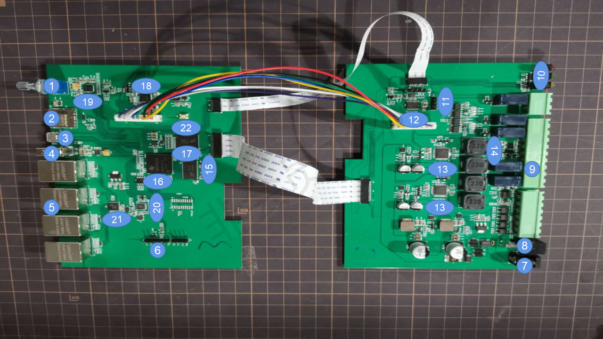

- **1. Knob:** Adjust the speaker volume.

- **2. SD Card Slot:** To plug in micro-SD card to update the Aurora firmware.

- **3. USB OTG:** This USB Port is used to connect to your computer via serial mode of putty.

- **4. USB Host:** You can plug USB device, such as USB mouse,USB keyboard and USB flash disk into Aurora via those two USB hosts.

- **5. Ethernet interface:** 4 x Ethernet Interface be controlled by the switch chip.

- **6. TTL UART:** You also can connect the Aurora with your computer via this UART port.

- **7. DC jack:** Input 24V/2.5A power.

- **8. Power switch:** Power on or power off the Aurora.

- **9. Extern Interface:** Include 1 x Record interface , 2 x Play interface , 3 x Relay output interface , 3 x GPIO input interface , 1 x Extern 12V interface.

- **10. LED:** Include power LED and user-defined LED , network status LED.

- **11. SWIM jack:** You can use this jack to update the mpu(stm8) firmware.

- **12. STM8:** Software power switch chip for Aurora.

- **13. TPA3106D1:** Amplifier for speaker.

- **14. MAX9814ETD:** Amplifier for Mic.

- **15. MT41K256M16TW:** 512M DDR3 RAM.

- **16. AM3358:** Main controller.

- **17. MTFC4GACAJCN:** 4GB EMMC Storage.

- **18. TPS65217CRSLR:** Power Management Chip.

- **19. TLV320AIC3104:** Audio codec chip.

- **20. LAN8710A:** 100M Network cable drive network card.

- **21. RTL8305NB:** Ethernet switch controller.

- **22. Power button:** power on or power off the AM3358.

## Extern Interface pinout

It is very useful when we test there pin.

For Aurora 100

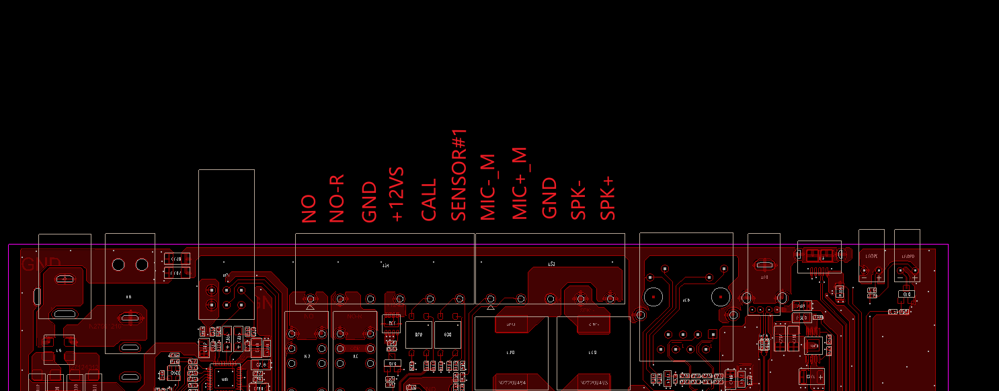

For Aurora 200


## Introduction To Software

### Preparatory Work

**Materials Required**

- Aurora100 or Aurora200
- Internet network
- Internet cable
- 4GB (or more memory) SD card and SD card reader
- PC or Mac
- [USB To Uart Adapter](https://www.seeedstudio.com/USB-To-Uart-5V%26amp%3B3V3-p-1832.html) (optional)
- 24V/2A DC interface adapter
- Especial Speaker x 1  (Aurora100) or Especial Speaker x 2  (Aurora200)
- Especial Mic

**Uptdate firmware**

- **Step 1.** Select the [firmware](https://beagleboard.org/latest-image) to download:

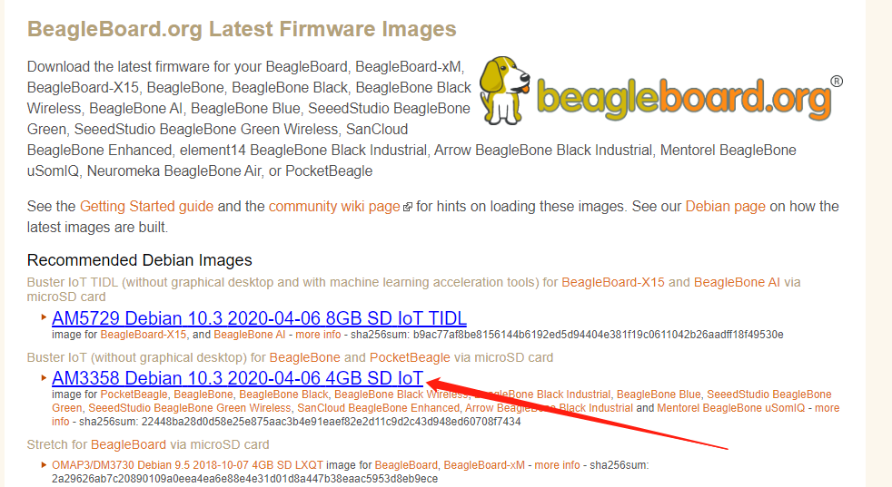

- **Step 2.** Connect an SD card to a PC or MAC with an SD card reader, an SD card with more than 4G memory is required.

- **Step 3.** Click here to download [Etcher](https://etcher.io/), then use the Etcher to write the  ```*.img.xz``` file directly to the SD card. Or extract the ```*.img.xz``` file into a ```*.img``` file, and then burn it to an SD card using another mirror write tool.

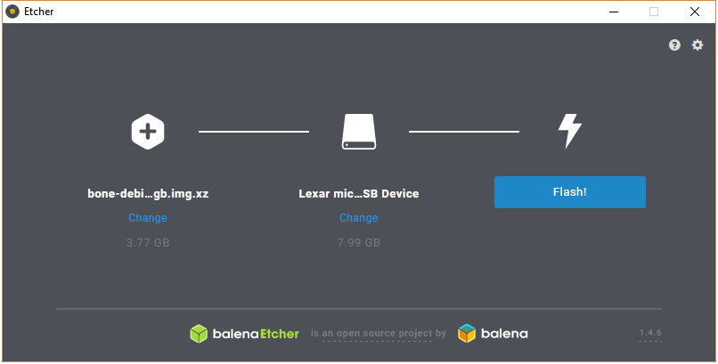

we can get below the picture when the etcher burns successful.

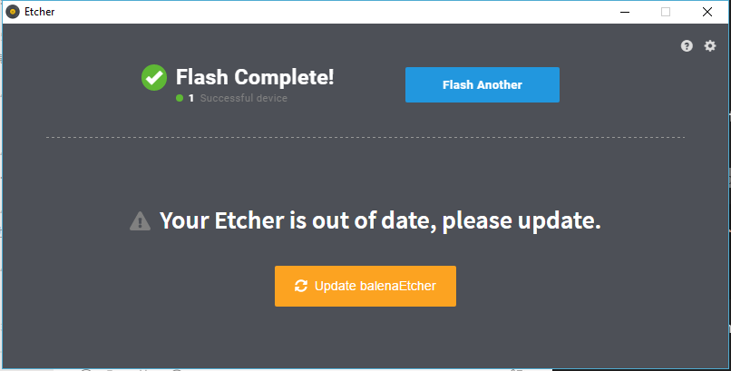

- **Step 4.** After writing the image to the SD card, insert the SD card into Aurora.

For Aurora 100

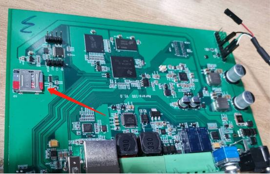

For Aurora 200

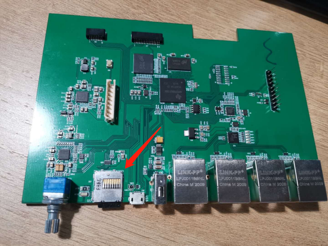

- **Step 5.** Connect Aurora to a computer by using USB To Uart Adapter.the hardware connection as below.

|Aurora|USB To Uart Adapter|
|:----:|:------:|
|TX|RX|
|RX|TX|	
|GND|GND|


For Aurora 100

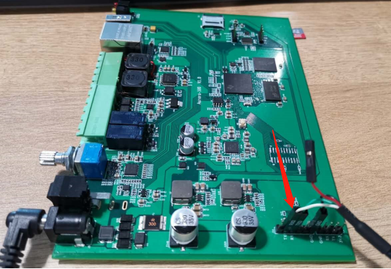

For Aurora 200

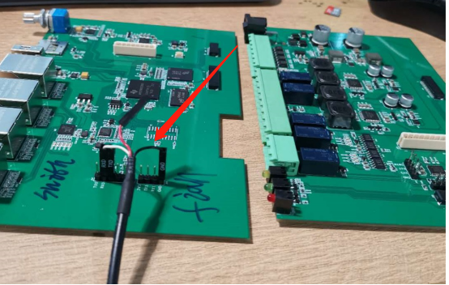

- **Step 6.** Connect RST to GND at stm8 to stop stm8 power-manager code.
For Aurora 100

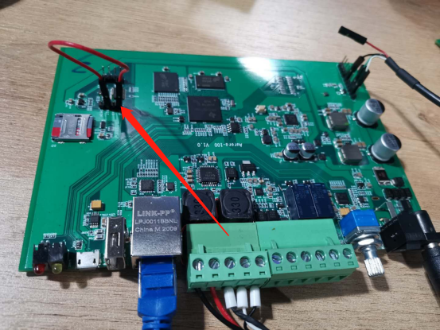

For Aurora 200

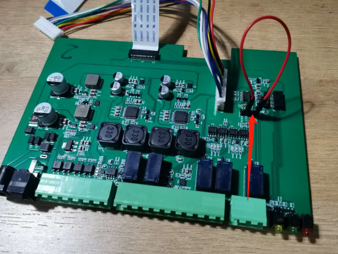

the system will reboot repeatedly if our firmware have not `power-manager.service`.and there does not exist `power-manager.service` at default firmware. So we have to connect RST to GND at stm8 to stop `power-manager.service   `. we will install the `power-manager.service` at subsequent steps.

- **Step 7.** Use a 24V Power adapter to power the Aurora board. and you can see the LED power on. Do not take out the SD card during writing.

- **Step 8.** Use [PUTTY](https://www.chiark.greenend.org.uk/~sgtatham/putty/latest.html), select `Serial` protocol, fill in the correct COM port of Aurora, 115200 baud, 8Bits, Parity None, Stop Bits 1, Flow Control None.

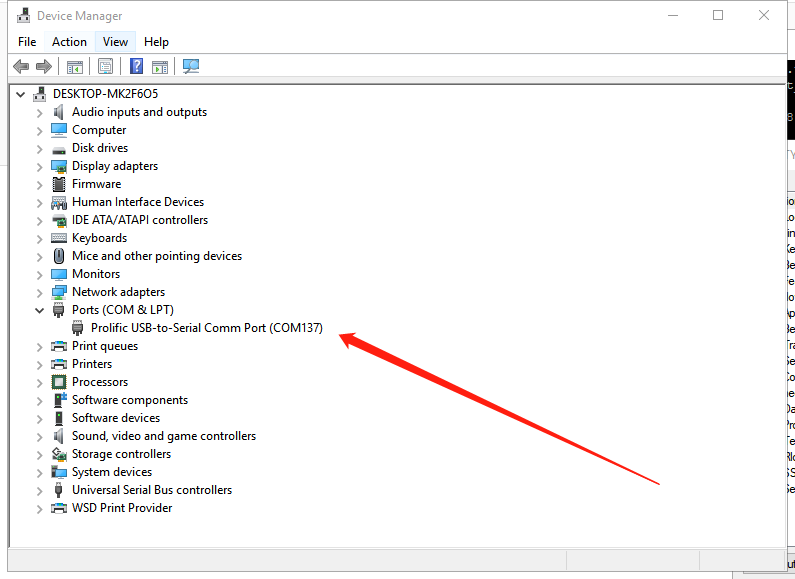

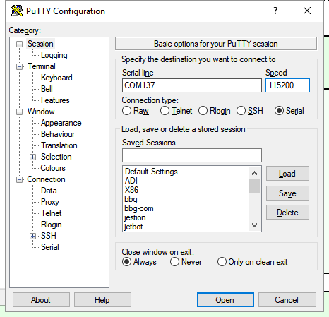

- **Step 9.** The login user name is `debian`, and password is `temppwd`.

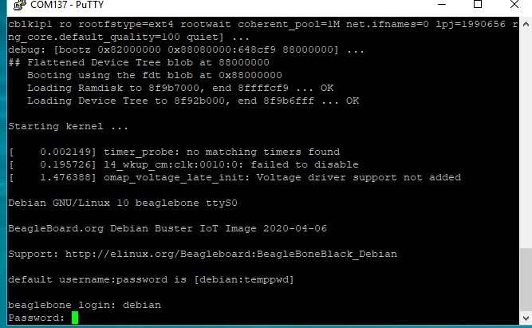

- **Step 10.** Edit `/boot/uEnv.txt` to start eMMC boot then reboot at Aurora.

```bash
sudo sh -c "echo cmdline=init=/opt/scripts/tools/eMMC/init-eMMC-flasher-v3.sh >> /boot/uEnv.txt"
sudo reboot
```

`if the update firmware finish, the terminal will show power-off cmd.`


You have to power off the board and unplug sd card If you terminal show this message.

- **Step 11.** Unplug `sd card` then power on.

If you boot at emmc , the terminal will print `/dev/mmcblk1p1`.

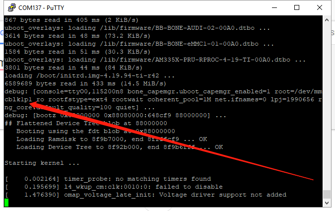

- **Step 12.** Connect Internet cable to Ethernet interface if the Green LED to blink and the Yellow LED to light that indicates the network work well.we can get as below information about the eth0 at Aurora if we type `ifconfig` cmd.

```bash
ifconfig
```

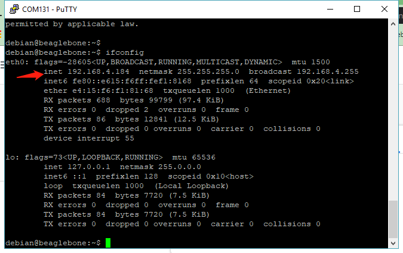

the ip addr maybe different for this picture depending on your router.

- **Step 13.** Internet test

```bash
ping -c 5 www.china.com
```

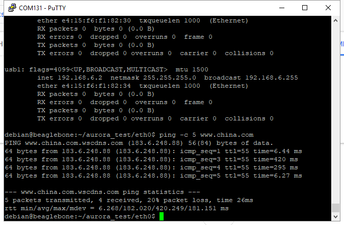

if the terminal print like this indicates the network has been connecting to the Internet.if we can not get the Internet maybe need to check your network environment.

### Devices Usage

**Env install**

- **Step 1.** git clone the test code.

```bash
cd ~
git clone https://github.com/Hansen0314/aurora_test.git
```

- **Step 2.** Install the gpio to control the gpio of Aurora.

```bash
sudo cp ~/aurora_test/gpio /bin/
```

- **Step 3.** Install the phytool to config the LAN of Aurora.

```bash
git clone https://github.com/wkz/phytool
cd ~/phytool
make
sudo make install
sudo cp /usr/local/bin/phytool /home/debian/aurora_test/eth0/
```

- **Step 4.** Install the power-service that communicate 
with stm8 to enable `power-manager.service`.

```bash
cd ~/aurora_test/power-service
sudo ./install.sh
```

you can disconnect GND to RST at stm8 for now.

- **Step 5.** Install voice card to enable speaker and mic then reboot.

```bash
sudo sh -c \
"echo uboot_overlay_addr0=/lib/firmware/BB-BONE-AUDI-02-00A0.dtbo >> /boot/uEnv.txt"
cd ~/aurora_test/voice_card
sudo cp asound.state /var/lib/alsa/
sudo cp asound.conf /etc/
sudo reboot
```

If the terminal prints no error go to next step.

**12+V**

we can use this cmd to make 12v power on.

```bash
gpio set 11
```

You can get 12v at J54(aurora 100)-pin4 or J21(aurora 200)-pin1 by using a multimeter.and the pin's location you can view the [Extern-Interface-pinout](##Extern%20Interface%20pinout).

we can use this cmd to make 12v power off.

```bash
gpio clear 11
```

**Input**

If you want to test input of aurora 100.

```bash
cd  ~/aurora_test/input
./input.sh 100
```

If you want to test input of aurora 200.

```bash
cd  ~/aurora_test/input
./input.sh 200
```

Connect input pin to GND that will print the name of the pin at the terminal.
and the pin's location you can view the [Extern-Interface-pinout](##Extern%20Interface%20pinout).
this is  Trigger sequence:
`CALL_IN -> SEN1_IN -> EXT_SEN -> SEN2_IN(aurora 200)`

the EXT_SEN's location for Aurora100


the EXT_SEN's location for Aurora200

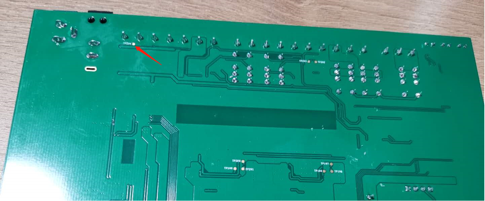

**LED state**

we can use this cmd to blink the user-define LED.

```bash
cd  ~/aurora_test/LED_state
./LED_test.sh
```

**Relay**

If you want to test relay of aurora 100 You can use this cmd.

```bash
gpio set 71 #make NO connect to GND
gpio clear 71 #make NO disconnect to GND
gpio set 47 #make NO-R connect to GND
gpio clear 47 #make NO-R disconnect to GND
```

If you want to test relay of aurora 200 You can use this cmd.

```bash
gpio set 71 #make NO connect to GND
gpio clear 71 #make NO disconnect to GND
gpio set 47 #make NO-R connect to GND
gpio clear 47 #make NO-R disconnect to GND
gpio set 27 #make NO-C connect to GND
gpio clear 27 #make NO-C disconnect to GND
```

and the pin's location you can view [Extern-Interface-pinout](##Extern%20Interface%20pinout).

**Voice card**

the voice card needs some time to setup after power on. So we need to check voice card setup successful before run `./power_on_voice.sh`.we can use aplay -l to check whether set up successful. we can get this message if set up successful.

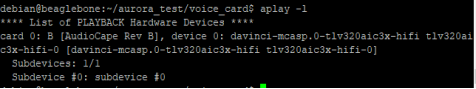


It is very important to check the connection of the Speaker and the Mic.and the pin's location you can view [Extern-Interface-pinout](##Extern%20Interface%20pinout).

For Aurora100

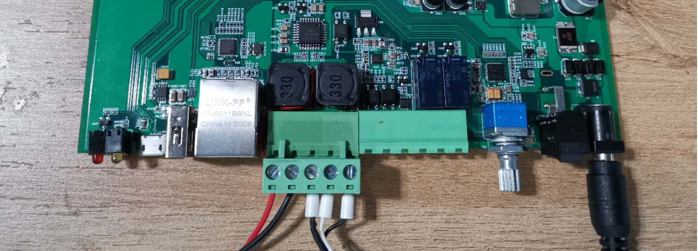

For Aurora200


if you use aurora 100 we can use this cmd to test it.

```bash
cd ~/aurora_test/voice_card
./power_on_voice.sh 1
```

if you use aurora 200 we can use this cmd to test it.

```bash
cd ~/aurora_test/voice_card
./power_on_voice.sh 1 #the one speaker
#./power_on_voice.sh 2 #the other speaker
```

you can hear your speech form the Speaker if you speak to the mic.and you can adjust the knob to modify the sound volume for hardware side.the software also supports adjust the sound volume by using `alsamixer`.

```bash 
sudo alsamixer
```

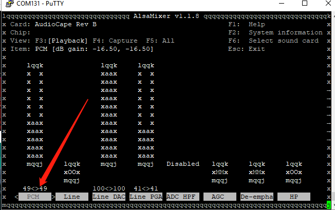

The asound.conf and asound.state that you can found by accessing [github](https://github.com/Hansen0314/aurora_test/tree/master/voice_card).

**Update STM8 firmware**

- **Step 1.** Download [stvp](https://drive.google.com/file/d/1hm5hKK_gqNOe6aBj4hlX1Di66oHQber4/view?usp=sharing) that is a download tool for stm8.
- **Step 2.** Open the stvp and config it.

Click `Project -> New`

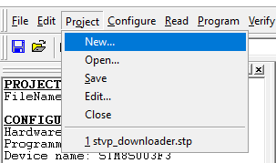

Select `ST-Link ->SWIM->STM8S00F3`
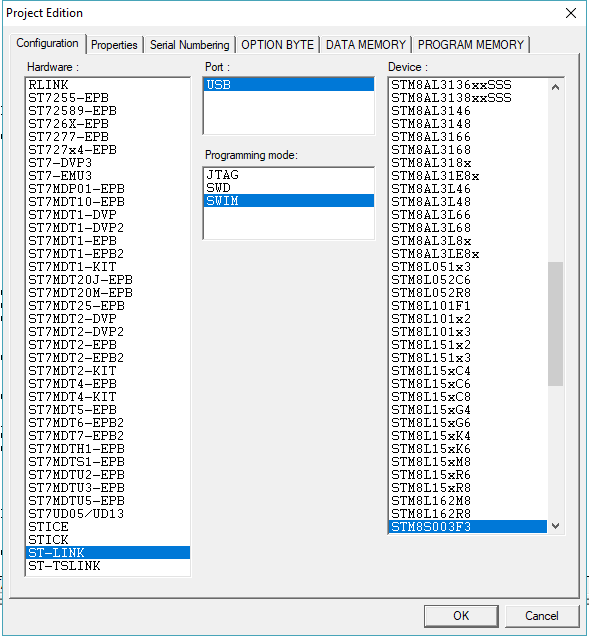

- **Step 3.** dowmload [firmware](https://github.com/Hansen0314/aurora_test/blob/master/power-service/STM8Firmware/power_manager.hex)


- **Step 4.**  Connect STM8 to the computer by ST-link

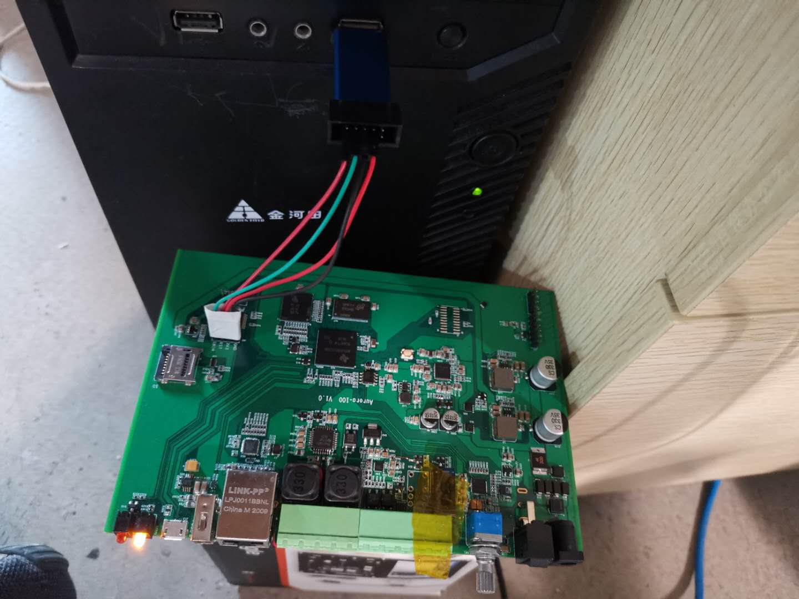

- **Step 5.** Open the firmware then burn it to stm8

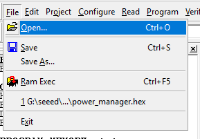

burn the firmware

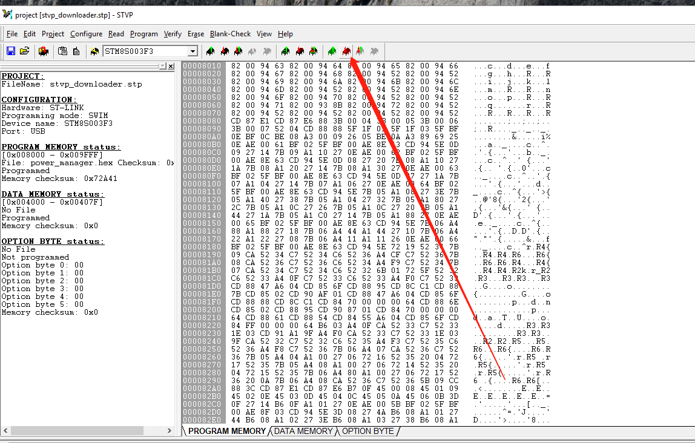

成功的现象

## Appendix

